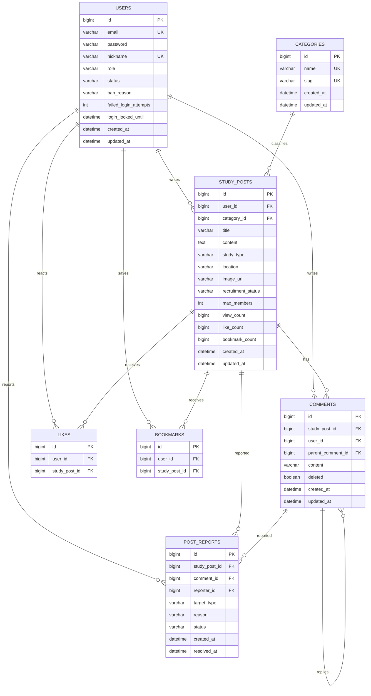

# 스터디모임 ERD

현재 구현된 JPA 엔티티를 기준으로 정리한 ERD입니다. 대표 이미지는 별도 테이블을 두지 않고 `study_posts.image_url`에 로컬 파일 접근 경로를 저장합니다.

## 독립 운영 테이블

다음 테이블은 특정 도메인 엔티티와 외래키로 직접 연결하지 않고 인증·운영 이력을 보관합니다.

### password_reset_verifications

| 컬럼 | 설명 |
| --- | --- |
| id | PK |
| email, nickname | 본인 확인 대상 |
| code_hash, code_expires_at | 인증번호 해시와 만료 시각 |
| reset_token_hash, reset_token_expires_at | 일회용 재설정 토큰 해시와 만료 시각 |
| verified_at, consumed_at | 인증 및 사용 완료 시각 |
| failed_code_attempts | 인증번호 실패 횟수 |
| created_at | 생성 시각 |

### admin_action_logs

| 컬럼 | 설명 |
| --- | --- |
| id | PK |
| action_type | 수행한 관리자 작업 |
| target_type, target_id | 작업 대상 종류와 ID |
| summary | 제재 사유·신고 사유 등 작업 요약 |
| admin_id, admin_nickname | 작업 당시 관리자 정보 스냅샷 |
| created_at | 수행 시각 |

## 주요 제약과 설계

- `users.email`, `users.nickname`, `categories.name`, `categories.slug`는 중복될 수 없습니다.
- 좋아요와 북마크는 각각 `(user_id, study_post_id)` 복합 unique 제약으로 중복 반응을 막습니다.
- 답글은 `comments.parent_comment_id` 자기 참조 관계로 표현합니다.
- 댓글 삭제는 답글 구조를 보존하기 위해 실제 행을 지우지 않고 `deleted` 상태로 처리합니다.
- 신고는 모집글을 항상 참조하고, 댓글 신고일 때만 `comment_id`를 함께 저장합니다.
