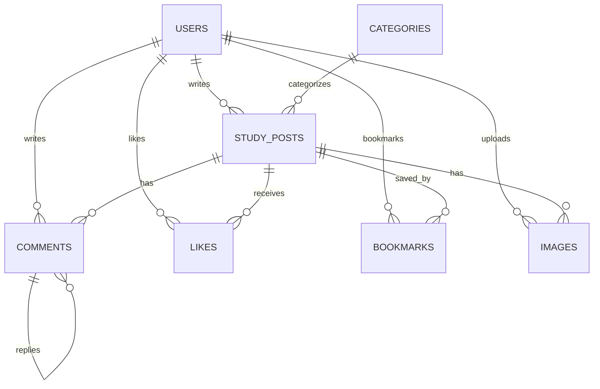

# 스터디모임 ERD 초안

스터디모임의 ERD는 MVP와 확장 기능을 나누어 생각합니다. 처음에는 회원, 카테고리, 모집글, 댓글부터 시작하고, 이후 좋아요, 북마크, 이미지, 관리자 기능을 추가합니다.

## 관계 초안

## MVP 테이블

### users

| 컬럼 | 설명 |
| --- | --- |
| id | PK |
| email | 로그인 이메일 |
| password | 비밀번호 hash |
| nickname | 닉네임 |
| role | USER, ADMIN |
| status | ACTIVE, DELETED, BANNED |
| created_at | 생성일 |
| updated_at | 수정일 |

### categories

| 컬럼 | 설명 |
| --- | --- |
| id | PK |
| name | 카테고리 이름 |
| slug | URL/검색용 값 |
| created_at | 생성일 |
| updated_at | 수정일 |

### study_posts

| 컬럼 | 설명 |
| --- | --- |
| id | PK |
| user_id | 작성자 FK |
| category_id | 카테고리 FK |
| title | 제목 |
| content | 내용 |
| study_type | ONLINE, OFFLINE, HYBRID |
| location | 오프라인 장소 |
| recruitment_status | RECRUITING, CLOSED |
| max_members | 모집 인원 |
| view_count | 조회수 |
| like_count | 좋아요 수 |
| bookmark_count | 북마크 수 |
| created_at | 생성일 |
| updated_at | 수정일 |

### comments

| 컬럼 | 설명 |
| --- | --- |
| id | PK |
| study_post_id | 모집글 FK |
| user_id | 작성자 FK |
| parent_comment_id | 대댓글 FK |
| content | 댓글 내용 |
| is_deleted | 삭제 여부 |
| created_at | 생성일 |
| updated_at | 수정일 |

## 확장 테이블

### likes

| 컬럼 | 설명 |
| --- | --- |
| id | PK |
| user_id | 사용자 FK |
| study_post_id | 모집글 FK |
| created_at | 생성일 |

`user_id + study_post_id` unique 제약을 둘 예정입니다.

### bookmarks

| 컬럼 | 설명 |
| --- | --- |
| id | PK |
| user_id | 사용자 FK |
| study_post_id | 모집글 FK |
| created_at | 생성일 |

`user_id + study_post_id` unique 제약을 둘 예정입니다.

### images

| 컬럼 | 설명 |
| --- | --- |
| id | PK |
| user_id | 업로드 사용자 FK |
| study_post_id | 모집글 FK |
| original_name | 원본 파일명 |
| stored_name | 저장 파일명 |
| url | 접근 경로 |
| content_type | 파일 타입 |
| size | 파일 크기 |
| created_at | 생성일 |

## 선택 테이블

### admin_logs

관리자 기능을 조금 더 정리하고 싶을 때 추가합니다.

| 컬럼 | 설명 |
| --- | --- |
| id | PK |
| admin_user_id | 관리자 FK |
| action | 작업 종류 |
| target_type | 대상 타입 |
| target_id | 대상 id |
| reason | 사유 |
| created_at | 생성일 |
