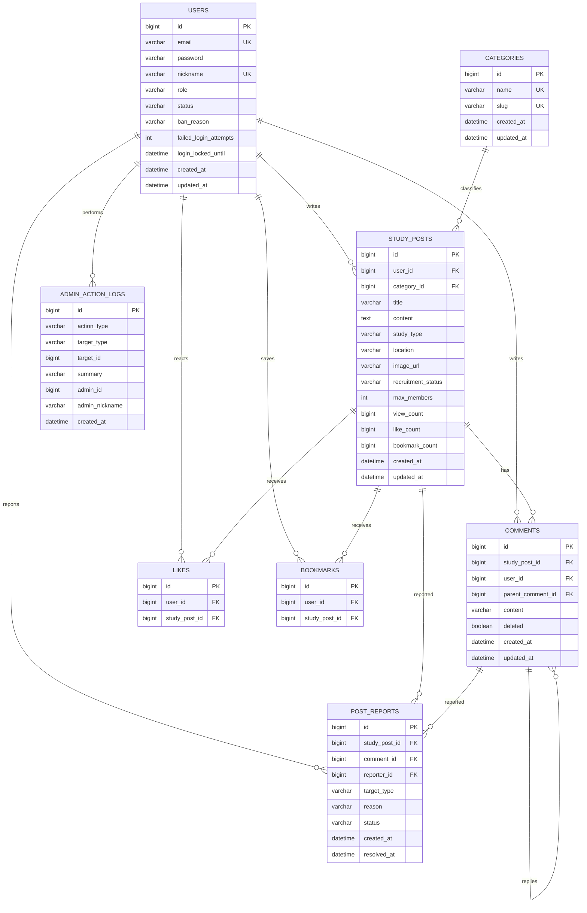

# 스터디모임 ERD

현재 구현된 JPA 엔티티와 운영 테이블을 기준으로 정리한 ERD입니다. 업로드 이미지는 별도 이미지 테이블을 두지 않고 `study_posts.image_url`에 파일 접근 경로를 저장합니다.

## 보조 운영 테이블

### password_reset_verifications

비밀번호 재설정 과정에서 이메일 인증번호와 재설정 토큰을 관리합니다.

| 컬럼 | 설명 |
| --- | --- |
| `id` | PK |
| `email`, `nickname` | 본인 확인 대상 |
| `code_hash`, `code_expires_at` | 인증번호 해시와 만료 시각 |
| `reset_token_hash`, `reset_token_expires_at` | 일회용 재설정 토큰 해시와 만료 시각 |
| `verified_at`, `consumed_at` | 인증 및 사용 완료 시각 |
| `failed_code_attempts` | 인증번호 실패 횟수 |
| `created_at` | 생성 시각 |

## 주요 제약과 설계 의도

- `users.email`, `users.nickname`, `categories.name`, `categories.slug`는 중복을 허용하지 않습니다.
- 좋아요와 북마크는 각각 `(user_id, study_post_id)` 복합 unique 제약으로 중복 반응을 막습니다.
- 답글은 `comments.parent_comment_id` 자기 참조 관계로 표현합니다.
- 댓글 삭제는 답글 구조를 보존하기 위해 실제 행을 지우지 않고 `deleted` 상태로 처리합니다.
- 신고는 모집글과 댓글을 하나의 테이블에서 관리하되 `target_type`으로 대상을 구분합니다.
- 관리자 작업은 별도 로그 테이블에 남겨 운영 중 수행한 제재, 삭제, 신고 처리 기록을 확인할 수 있게 했습니다.
